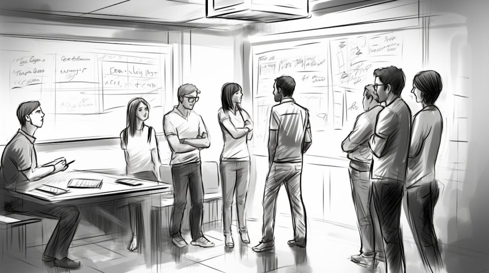
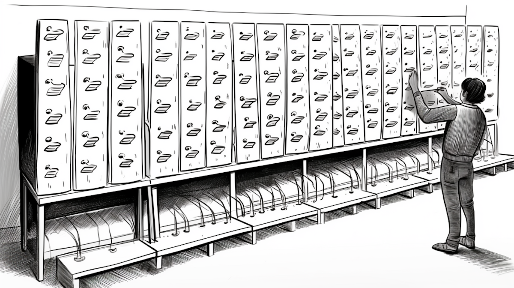

```{r setup, include=FALSE}
usethis::use_git_ignore(c("*.csv", "*.rds"))
options(htmltools.dir.version = FALSE)

library(knitr)
library(tidyverse)
library(xaringan)
library(fontawesome)
```

class: inverse, center, middle

# `r fa("fas fa-images", fill = "#fff")`

**View the slides:** 

[bretsw.com/edf5442-ss24-module3](https://bretsw.com/edf5442-ss24-module3)

---

class: inverse, center, middle

# Standup

```{r, out.width = "100%", echo = FALSE, fig.align = "center"}

```

---

class: inverse, center, middle

# `r fa("fas fa-map", fill = "#fff")` <br><br> Stories of Getting the Wrong Directions

---

class: inverse, center, middle

# Sorting

```{r, out.width = "100%", echo = FALSE, fig.align = "center"}

```


---

class: inverse, center, middle

# Scrum

```{r, out.width = "100%", echo = FALSE, fig.align = "center"}
include_graphics("img/scrum.png")
```

---

# `r fa("fas fa-map", fill = "#fff")` Feedback: Inquiry Plan

```{r, out.width = "600px", echo = FALSE, fig.align = "center"}
include_graphics("img/planning.png")
```

1. Topic + Question
2. Population + Sample
3. Data Collection Method: Survey + Interviews + Test Items
4. Subquestions Addressed
5. Division of Labor
6. Questions and/or Concerns


---

class: inverse, center, middle

# Standup

```{r, out.width = "100%", echo = FALSE, fig.align = "center"}

```

---

class: inverse, center, middle

#  `r fa("fas fa-map", fill = "#fff")` <br><br> Levels of Measurement `r fa("fas fa-arrow-right", fill = "#fff")` <br> Data Collection `r fa("fas fa-arrow-right", fill = "#fff")` Sampling


---

class: inverse, center, middle

# `r fa("fas fa-ruler", fill = "#fff")` <br><br> Levels of Measurement

---

# `r fa("fas fa-ruler", fill = "#fff")` Levels of Measurement

```{r, out.width = "100%", echo = FALSE, fig.align = "center"}
include_graphics("img/planning.png")
```

- `r fa("fas fa-book-open-reader", fill = "#782F40")` Levels of Measurement and Their Importance: One Potato, Two Potato (Salkind & Frey, 2023, Ch. 2)

---

# `r fa("fas fa-ruler", fill = "#fff")` Levels of Measurement

<iframe width="100%" height="420px" src="https://www.youtube.com/embed/5Yh-9xdJzAs?si=JawoQSvY1YMxHLIe" title="YouTube video player" frameborder="0" allow="accelerometer; autoplay; clipboard-write; encrypted-media; gyroscope; picture-in-picture; web-share" allowfullscreen></iframe>

---

# `r fa("fas fa-ruler", fill = "#fff")` Levels of Measurement

### Nominal, Ordinal, Interval & Ratio Data

```{r, out.width = "520px", echo = FALSE, fig.align = "center"}

```

--

<hr>

- **Nominal:** different groups: categorical, discrete, qualitative

--

- **Ordinal:** on a continuum

--

- **Interval:** on a continuum with equal intervals

--

- **Ratio:** on a continuum with equal intervals and an absolute zero (absence)

---

# `r fa("fas fa-ruler", fill = "#fff")` Levels of Measurement

### On the Theory of Scales of Measurement (Stevens, 1946)

[**FSU Libraries link**](https://fsu-flvc.primo.exlibrisgroup.com/permalink/01FALSC_FSU/1pc67ru/cdi_openaire_primary_doi_dedup_ce282006ba8c65801fbe32d80fde52e1)

```{r, out.width = "680px", echo = FALSE, fig.align = "center"}

```

<hr>

- **Nominal:** different groups: categorical, discrete, qualitative

- **Ordinal:** on a continuum

- **Interval:** on a continuum with equal intervals

- **Ratio:** on a continuum with equal intervals and an absolute zero (absence)

---

# `r fa("fas fa-ruler", fill = "#fff")` Levels of Measurement

### Look at Annotated Bibliography

```{r, out.width = "520px", echo = FALSE, fig.align = "center"}
include_graphics("img/thinking.png")
```

<hr>

- **Nominal:** different groups: categorical, discrete, qualitative

- **Ordinal:** on a continuum

- **Interval:** on a continuum with equal intervals

- **Ratio:** on a continuum with equal intervals and an absolute zero (absence)


---

class: inverse, center, middle

# `r fa("fas fa-bucket", fill = "#fff")` <br><br> Data Collection

---

# `r fa("fas fa-bucket", fill = "#fff")` Data Collection

```{r, out.width = "400px", echo = FALSE, fig.align = "center"}
include_graphics("img/planning.png")
```

### How to collect data?

--

- `r fa("fas fa-book-open-reader", fill = "#782F40")` Selecting Appropriate Data Collection Methods (O'Leary, 2005, Ch. 6)

--

  - **Surveys** (p. 103)

--

  - **Interview** (p. 113)

--

  - **Observation** (p. 119)
  
--

  - **Unobtrusive** (p. 126)
  
--

  - **Intervention** (p. 132)

---

# `r fa("fas fa-bucket", fill = "#fff")` Data Collection

```{r, out.width = "400px", echo = FALSE, fig.align = "center"}
include_graphics("img/planning.png")
```

### How to collect data?

- `r fa("fas fa-book-open-reader", fill = "#782F40")` Research that Moves from Knowledge to Action (O'Leary, 2005, Ch. 9)

--

  - **Action Research** (p. 192)
 
---

# `r fa("fas fa-bucket", fill = "#fff")` Data Collection

### Action Research

```{r, out.width = "450px", echo = FALSE, fig.align = "center"}

```
  
---

# `r fa("fas fa-bucket", fill = "#fff")` Data Collection

```{r, out.width = "400px", echo = FALSE, fig.align = "center"}
include_graphics("img/planning.png")
```

### How to collect data?

- `r fa("fas fa-book-open-reader", fill = "#782F40")` Research that Moves from Knowledge to Action (O'Leary, 2005, Ch. 9)

  - **Action Research** (p. 192)
  
--

- `r fa("fas fa-book-open-reader", fill = "#782F40")` Evaluating Change (O'Leary, 2005, Ch. 10)

--

  - **Evaluative Research** *See Table 10.3 (p. 221)


---

class: inverse, center, middle

# `r fa("fas fa-cubes-stacked", fill = "#fff")` <br><br> Sampling

---

# `r fa("fas fa-cubes-stacked", fill = "#fff")` Sampling

<iframe width="100%" height="420px" src="https://www.youtube.com/embed/sonXfzE1hvo?si=VEVQMxR_HrE1KR8u" title="YouTube video player" frameborder="0" allow="accelerometer; autoplay; clipboard-write; encrypted-media; gyroscope; picture-in-picture; web-share" allowfullscreen></iframe>

--

- `r fa("fas fa-book-open-reader", fill = "#782F40")` The Quest for 'Respondents' (O'Leary, 2005, Ch. 5, pp. 92-95)


---

class: inverse, center, middle

# Project Teams

```{r, out.width = "100%", echo = FALSE, fig.align = "center"}
include_graphics("img/scrum.png")
```

**Take a fresh look at your Inquiry Plan**


---

class: inverse, center, middle

# Standup

```{r, out.width = "100%", echo = FALSE, fig.align = "center"}

```


---

class: inverse, center, middle

# `r fa("fas fa-binoculars", fill = "#fff")` <br><br> Looking ahead

---

# `r fa("fas fa-calendar-day", fill = "#fff")` Semester Schedule

```{r, out.width = "360px", echo = FALSE, fig.align = "center"}
include_graphics("img/across-time.jpg")
```

- **Module 1:** Introduction to Inquiry

- **Module 2:** Reviewing the Literature

- **Module 3: Planning for Inquiry**

- **Module 4:** Measurement: Surveys & Tests

- **Module 5:** Measurement: Interviews

- **Module 6:** Analysis: Quantitative

- **Module 7:** Analysis: Qualitative

- **Module 8:** Ethics & Reporting

---

# `r fa("far fa-keyboard", fill = "#fff")` Major Assignments

```{r, out.width = "240px", echo = FALSE, fig.align = "center"}
include_graphics("img/build.jpg")
```

### Individual Assignments (20%)

- ~~Problem Statement and Annotated Bibliography (10%)~~
- **Test Items** (10%) - due in Module 6

### Group Assignments (50%)

- **Inquiry Plan (5%) - due in Module 4**
- **Survey Instrument** (10%) - due in Module 5
- **Interview Protocol** (10%) - due in Module 6
- **Survey Reflection & Write-up** (10%) - due in Module 7
- **Final Report** (15%) - due in Module 8

### Participation (30%)

- **Weekly Class Activities** (2% each week)

---

class: inverse, center, middle

# `r fa("fas fa-question", fill = "#fff")` <br><br> Questions

<hr>

**What questions can I answer for you now?**

**How can I support you this week?**

<hr>

`r fa("fas fa-envelope", fill = "#fff")` [bret.staudtwillet@fsu.edu](mailto:bret.staudtwillet@fsu.edu) | `r fa("fas fa-globe", fill = "#fff")` [bretsw.com](https://bretsw.com) | `r fa("fab fa-github", fill = "#fff")` [GitHub](https://github.com/bretsw/)